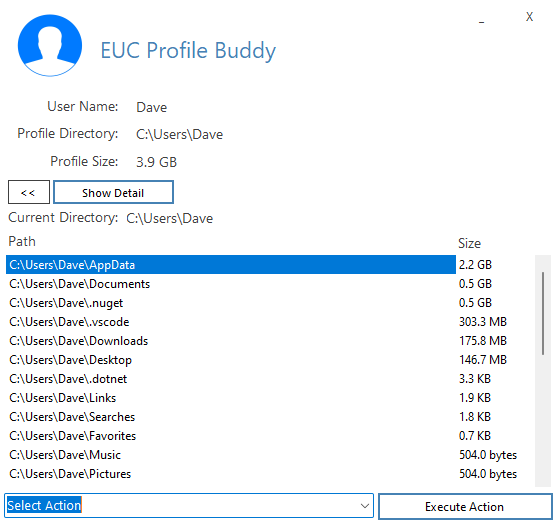

# EUC Profile Buddy

This utility will allow you to manage your End User Computing (EUC) profiles directly from the system tray or the command line. 

You have the ability to check on profile size and data usage along with clearing out unused files and folders. It will also allow you to perform common tasks on the profile to stop the need for that call to support to resolve issues. There is a profile detail screen to show the user the configuration settings in place driving the profile solution.

For full information and documentation please visit [this](https://bretty.me.uk/projects/EUC-Profile-Buddy/) link.
